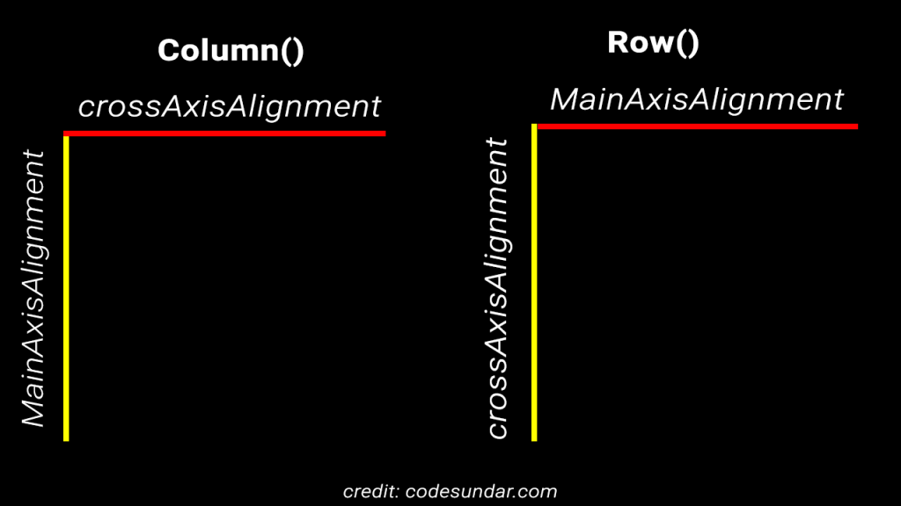

# Desvendando o Widget Column do Flutter 🦋

- [O que esse widget faz?](#o-que-esse-widget-faz)
- [Quando é interessante usar?](#quando-é-interessante-usar)
- [Desvendando suas propriedades](#desvendando-suas-propriedades)
  - [Alinhando sua Column](#alinhando-sua-column)
    - [crossAxisAlignment](#crossaxisalignment--recebe--crossaxisaligment)
    - [mainAxisAligment][def]
  - [Outras propriedades](#outras-propriedades)
    - [children](#children--recebe--listwidget)
    - [mainAxisSize](#mainaxissize--recebe--mainaxissize)
    - [textBaseline](#textbaseline--recebe--textbaseline)
    - [textDirection](#textdirection--recebe--textdirection)
    - [verticalDirection](#verticaldirection--recebe--verticaldirection)

## 🤔 O que esse widget faz?

Esse widget permite que você tenha um array vertical de `children`, esse array, por sua vez, é composto por widgets.

## 🤔 Quando é interessante usar?

Quando você quer ter vários widgets na sua árvore. Lembrando que o widget `Column` não possui scroll.

## ✨ Desvendando suas propriedades

### ◽ Alinhando sua `Column`

#### `crossAxisAlignment > recebe > CrossAxisAligment`

Alinha os `children` de acordo com o eixo horizontal.

#### `mainAxisAligment > recebe > MainAxisAligment`

Alinha os `children` de acordo com o eixo vertical.

### ◽ Outras propriedades

#### `children > recebe > List<Widget>`

Essa propriedade recebe uma lista de widgets, aqui você vai colocar todos os widgets que quer dentro da sua `Column`.

#### `mainAxisSize > recebe > MainAxisSize`

Determina o quanto de espaço que uma `Column` pode ocupar em seu eixo principal, que é o vertical.

#### `textBaseline > recebe > TextBaseline?`

Alinha os itens de acordo com a sua baseline.

#### `textDirection > recebe > TextDirection?`

Alinha os `children` horizontalmente.

#### `verticalDirection > recebe > VerticalDirection`

Alinha os `children` verticalmente.

[def]: #mainaxisaligment--recebe--mainaxisaligment
